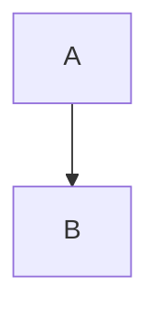
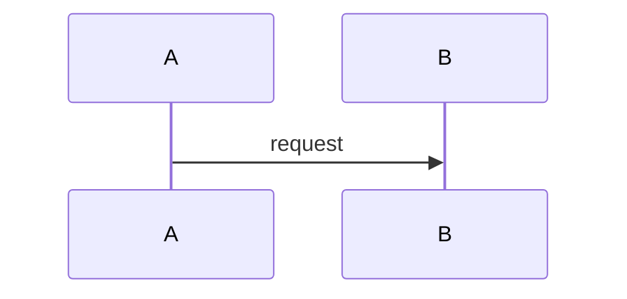
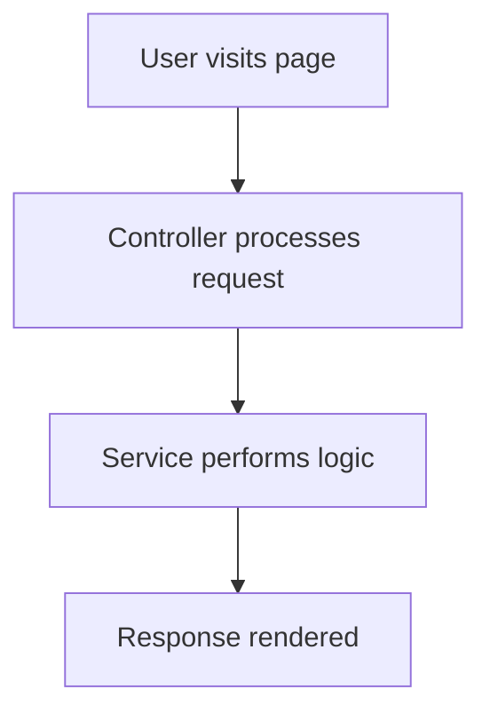
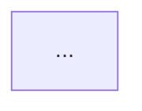
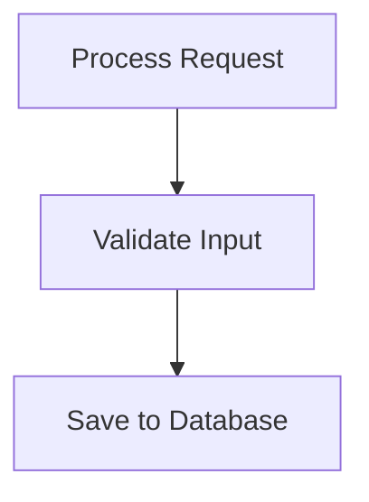
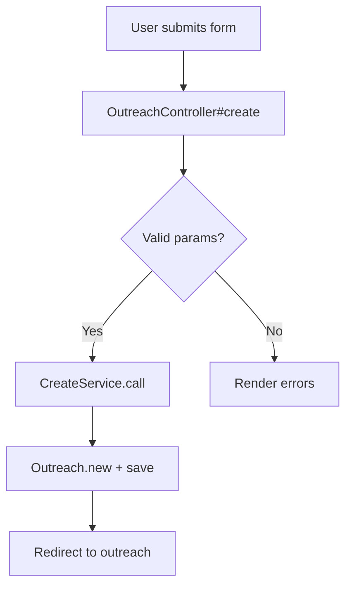

# Writing Documentation for Doc Viewer

This guide covers the Markdown format used to write documentation pages that the Doc Viewer can render. It explains frontmatter, prose sections, Mermaid diagrams with source-code links, and navigation between pages.

## Table of Contents

- [File Location and Discovery](#file-location-and-discovery)
- [File-System Routing](#file-system-routing)
- [Frontmatter](#frontmatter)
- [Prose Sections](#prose-sections)
- [Linking Between Documentation Pages](#linking-between-documentation-pages)
- [Mermaid Diagrams](#mermaid-diagrams)
- [Linking Diagram Nodes to Source Code](#linking-diagram-nodes-to-source-code)
- [Sequence Diagrams](#sequence-diagrams)
- [Complete Example](#complete-example)
- [Troubleshooting](#troubleshooting)

---

## File Location and Discovery

Documentation files live in your target repository under the directory configured by the `DOCS_PATH` environment variable (e.g., `docs/`). The build step recursively discovers all `.md` files in that directory.

The following directories are automatically ignored during discovery:

- `node_modules`
- `.git`
- `.claude`
- `dist`
- `vendor`

Files are sorted alphabetically by path before processing.

## File-System Routing

The directory structure of your docs folder directly determines the URL routes in the viewer. The `.md` extension is stripped, and `index.md` files become the route for their containing directory.

| File path (relative to docs dir) | Route |
| --- | --- |
| `index.md` | `/` |
| `outreach/index.md` | `/outreach` |
| `outreach/workflows/foo.md` | `/outreach/workflows/foo` |
| `some-page.md` | `/some-page` |

### Index pages

A file named `index.md` in any directory acts as the **section page** for that directory. In the viewer, section pages display cards linking to all child pages in that directory. This is how you create navigable sections with overview pages.

If a directory contains child pages but has no `index.md`, a synthetic index page is automatically generated at build time with a title derived from the directory name (underscores become spaces, title-cased).

### Directory structure example

```
docs/
  index.md                        -> /           (root section page)
  outreach/
    index.md                      -> /outreach   (section page with child cards)
    creating-an-outreach.md       -> /outreach/creating-an-outreach
    workflows/
      index.md                    -> /outreach/workflows
      send-workflow.md            -> /outreach/workflows/send-workflow
```

## Frontmatter

Every documentation file should start with YAML frontmatter between `---` delimiters:

```markdown
---
title: Creating an Outreach
description: How the outreach creation flow works end-to-end.
tags: [outreach, controllers, services]
---
```

### Fields

| Field | Required | Default | Description |
| --- | --- | --- | --- |
| `title` | Recommended | First `# Heading` in the body, or `"Untitled"` | Page title displayed in the viewer header, breadcrumbs, and nav tree |
| `description` | Optional | `""` | Short description shown on parent index page cards |
| `tags` | Optional | `[]` | Array of keyword tags for categorization |

If you omit `title`, the build will attempt to extract it from the first top-level heading (`# Some Title`) in the document body. If neither exists, the page will be titled "Untitled".

## Prose Sections

Everything outside of Mermaid code fences is treated as **prose** and rendered as standard Markdown. The viewer uses GitHub Flavored Markdown (GFM), so you can use:

- Headings (`##`, `###`, etc.)
- Bold, italic, strikethrough
- Ordered and unordered lists
- Tables
- Code blocks (fenced with triple backticks and a language tag)
- Inline code
- Blockquotes
- Raw HTML (passed through via `rehype-raw`)
- Images

Prose sections and Mermaid diagrams alternate naturally. You can have multiple prose sections and multiple diagrams in a single document:

```markdown
---
title: My Page
---

## Overview

Some introductory prose...

## Architecture Diagram



## More Details

Additional prose explaining the diagram above...

## Sequence Diagram


```

## Linking Between Documentation Pages

Links between pages in your documentation use **standard Markdown link syntax** with **relative paths based on routes, not file paths**.

### Key rule: use route paths, not file paths

Internal links must use the route form of the target page (no `.md` extension). The viewer resolves links relative to the current page's directory at render time.

```markdown
<!-- CORRECT: route-based relative links -->
[See the send workflow](workflows/send-workflow)
[Back to outreach overview](..)
[Go to another section](../donations/index)

<!-- WRONG: file path with .md extension -->
[See the send workflow](workflows/send-workflow.md)
```

### How relative links resolve

Links are resolved relative to the current page's **directory** (not the page itself). For a page at route `/outreach/workflows/foo`:

- The current directory is `/outreach/workflows`
- `../bar` resolves to `/outreach/bar`
- `baz` resolves to `/outreach/workflows/baz`
- `../../donations` resolves to `/donations`

For a page at route `/outreach` (an index page):

- The current directory is `/outreach` (index pages are treated as being "inside" their directory, not one level up -- but since the route is `/outreach`, stripping the last segment gives `/`)
- Wait -- let me be precise: the current directory is derived by stripping the last segment of the route. For `/outreach`, that gives `/`. So `workflows/foo` resolves to `/workflows/foo`. To link to a child page from an index page, you'd write `[Foo](outreach/workflows/foo)` only from the root. From `/outreach`, you'd write `[Foo](workflows/foo)`.

Here's a reference table:

| Current page route | Link in Markdown | Resolved route |
| --- | --- | --- |
| `/outreach/workflows/foo` | `../bar` | `/outreach/bar` |
| `/outreach/workflows/foo` | `send-workflow` | `/outreach/workflows/send-workflow` |
| `/outreach/workflows/foo` | `../../donations` | `/donations` |
| `/outreach` | `creating-an-outreach` | `/creating-an-outreach` |
| `/` | `outreach/workflows/foo` | `/outreach/workflows/foo` |

**Important note for index pages:** Because the current directory is computed by stripping the last path segment from the route, an index page at `/outreach` has current directory `/` (the segment `outreach` is stripped). This means relative links from index pages resolve from the **parent** directory. To link to child pages from an index page, include the directory name:

```markdown
<!-- From /outreach (index.md), linking to /outreach/creating-an-outreach -->
[Creating an Outreach](outreach/creating-an-outreach)
```

### External links

External URLs (anything starting with a protocol like `https://` or `mailto:`) automatically open in a new tab:

```markdown
[GitHub](https://github.com/your-org/your-repo)
[Email us](mailto:team@example.com)
```

### Anchor links

Links starting with `#` are rendered as standard anchor elements:

```markdown
[Jump to section](#some-heading)
```

## Mermaid Diagrams

Mermaid diagrams are written inside fenced code blocks with the `mermaid` language tag:

````markdown

````

The viewer supports any Mermaid diagram type (flowcharts, sequence diagrams, etc.), but the **source-code linking** feature (click directives) is specifically designed for **flowcharts** and **sequence diagrams**.

### Diagram IDs

Each diagram is automatically assigned an ID based on the nearest preceding Markdown heading. For example, if you have:

```markdown
## Architecture Flowchart


```

The diagram gets the ID `architecture-flowchart` (the heading slugified: lowercased, non-alphanumeric characters replaced with hyphens). If there is no preceding heading, the diagram gets a generic ID like `diagram-0`. These IDs are used internally for rendering.

## Linking Diagram Nodes to Source Code

This is the core feature of Doc Viewer: clicking a node in a Mermaid diagram opens a popover showing the actual source code from your repository.

### Click directive syntax

Add `click` directives **inside** your Mermaid code fence, after the diagram definition:

````markdown

````

### Format breakdown

```
click <NodeID> href "#" "<filepath>"
click <NodeID> href "#" "<filepath>:<startLine>-<endLine>"
```

| Part | Description |
| --- | --- |
| `click` | Keyword (literal) |
| `<NodeID>` | Must exactly match a node ID defined in the diagram (e.g., `A`, `B`, `myNode`) |
| `href "#"` | **Mandatory literal string.** This is a no-op anchor -- the viewer intercepts clicks via JavaScript. You must include this exactly as shown. |
| `"<filepath>"` | Path to the source file, **relative to the repository root** (not relative to the docs directory). Wrapped in double quotes. |
| `:<startLine>-<endLine>` | **Optional.** Line range within the file. Both start and end are required if specifying a range (e.g., `:15-45`). |

### File references

File paths in click directives are **relative to the root of the target repository**, not relative to the docs directory. For example:

```
click A href "#" "app/controllers/outreach_controller.rb:29-49"
click B href "#" "app/services/outreach/create_service.rb"
```

### With line ranges

When you specify a line range like `:29-49`, the popover displays those specific lines with 2 lines of context above and below. The focused lines are highlighted, and the context lines are dimmed.

```
click A href "#" "app/controllers/foo.rb:29-49"
```

This shows lines 27-51 (29-49 focused, with 2 lines of context on each side), with line numbers starting at 27.

### Without line ranges

When you omit the line range, the popover shows the entire file. If the file exceeds 100 lines, it is truncated with a `// ... truncated ...` indicator.

```
click B href "#" "app/services/bar.rb"
```

### What happens at build time

The build step processes click directives in two ways:

1. **Extracts the mapping** -- Each `click` directive creates an entry in the diagram's `nodeFiles` map, associating the node ID with the file path and optional line range.
2. **Strips the directives from the diagram** -- Click directive lines are removed from the Mermaid definition before rendering, so Mermaid never sees them (they would otherwise be interpreted as real hyperlinks and cause rendering issues).

A separate build step then collects every unique source file path referenced across all diagrams and fetches the **full content** of each file. Line extraction happens at render time in the browser, not at build time.

### Node matching in the rendered SVG

When the viewer renders a Mermaid diagram to SVG, it needs to find the DOM element corresponding to each node ID so it can attach click handlers. It uses five strategies in order:

1. **Flowchart ID pattern**: Looks for elements with `id` containing `flowchart-{nodeId}-` (Mermaid's default flowchart node ID format)
2. **Direct ID**: Exact `id` match on the element
3. **Data-ID attribute**: Matches `data-id="{nodeId}"`
4. **Participant text matching**: For sequence diagrams, searches `<text>` elements for the participant's display name (see [Sequence Diagrams](#sequence-diagrams))
5. **ID-contains fallback**: Any element whose `id` contains the node ID string

For flowcharts, strategy 1 handles most cases. For sequence diagrams, strategy 4 is critical.

### Clickable node styling

Nodes with click directives get `cursor: pointer` and a CSS class `clickable-node`, making them visually distinct and interactive.

## Sequence Diagrams

Sequence diagrams work with click directives too, but require a `participant ... as ...` declaration to enable node matching:

````markdown
```mermaid
sequenceDiagram
  participant C as Outreach<br/>Controller
  participant S as Create<br/>Service
  participant M as Outreach<br/>Model

  C->>S: create(params)
  S->>M: new + save
  M-->>S: outreach
  S-->>C: result

  click C href "#" "app/controllers/outreach_controller.rb:29-49"
  click S href "#" "app/services/outreach/create_service.rb:10-35"
  click M href "#" "app/models/outreach.rb"
```
````

### How participant matching works

In sequence diagrams, Mermaid renders participants differently from flowchart nodes (no `flowchart-{id}` pattern in the SVG). The build step extracts a **participant map** from lines matching:

```
participant ALIAS as Display Name
```

At render time, the viewer searches all `<text>` elements in the SVG for those containing the participant's display name and attaches click handlers to the parent `<g>` group element. This matches both the top and bottom participant boxes in the rendered sequence diagram.

### Multi-line participant labels

You can use `<br/>` in participant display names for multi-line labels:

```
participant C as Outreach<br/>Controller
```

The `<br/>` tags are normalized to spaces when building the participant map for text matching, so the viewer correctly matches against the rendered text content.

## Complete Example

Here's a full documentation file demonstrating all features:

````markdown
---
title: Creating an Outreach
description: How the outreach creation flow works, from form submission to database persistence.
tags: [outreach, controllers, services, models]
---

## Overview

When a user creates a new outreach, the request flows through several layers
of the application. The controller validates the session, the service handles
business logic, and the model persists the data.

For background on the outreach data model, see [Outreach Models](../models/outreach).

## Request Flow



## Service Interaction

```mermaid
sequenceDiagram
  participant C as Outreach<br/>Controller
  participant S as Create<br/>Service
  participant M as Outreach<br/>Model
  participant N as Notification<br/>Service

  C->>S: call(params)
  S->>M: create!(attrs)
  M-->>S: outreach
  S->>N: notify(:created, outreach)
  N-->>S: ok
  S-->>C: Result.success(outreach)

  click C href "#" "app/controllers/outreach_controller.rb:29-49"
  click S href "#" "app/services/outreach/create_service.rb:10-35"
  click M href "#" "app/models/outreach.rb"
  click N href "#" "app/services/notification_service.rb:15-28"
```

## Error Handling

If validation fails, the controller re-renders the form with error messages.
See [Error Handling Patterns](../patterns/error-handling) for the shared
approach used across all controllers.
````

## Troubleshooting

### Click directive not working

- Verify the exact format: `click <NodeID> href "#" "<filepath>"`. The `href "#"` part is mandatory and must be exactly as shown.
- Make sure the `NodeID` matches a node defined in the diagram. For flowcharts, this is the ID before the brackets: in `A[Some Label]`, the ID is `A`.
- Check that file paths are relative to the **repository root**, not the docs directory.

### Line range not being recognized

- The format must be `:<startLine>-<endLine>` with both numbers (e.g., `:29-49`).
- Single line references like `:42` are **not supported** -- they'll be treated as part of the file path. Use a range like `:42-42` instead.

### Internal link goes to wrong page

- Make sure you're using **route paths** (no `.md` extension), not file paths.
- Remember that relative links resolve from the current page's **parent directory**, not from the page itself. A page at `/outreach/workflows/foo` resolves links relative to `/outreach/workflows`.
- For index pages, be aware that the current directory is the **parent** of the route. A page at `/outreach` resolves links relative to `/`.

### Source file shows "File not found"

- Verify the file path exists in the target repository at the branch/ref being used.
- File paths are case-sensitive.

### Mermaid diagram not rendering

- Ensure the code fence uses exactly `` ```mermaid `` (lowercase, no extra spaces before the newline).
- Validate your Mermaid syntax using the [Mermaid Live Editor](https://mermaid.live).

### Participant clicks not working in sequence diagrams

- You must use the `participant ALIAS as Display Name` syntax. Without the `as` clause, the viewer cannot build a participant map for text-based matching.
- If your display name contains `<br/>` tags, make sure they are in the format `<br/>` (the parser handles case variations, but stick to this form for consistency).
