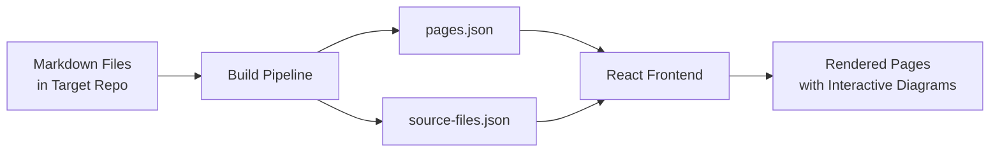

## What is Doc Viewer?

Doc Viewer is a React + Vite static site that renders markdown documentation with interactive Mermaid diagrams. Clicking a node in any diagram opens a popover showing the actual source code from a target repository. The viewer has no content of its own — it discovers, fetches, and renders docs from any configured repo.

## How It Works



## Core Concepts

| Concept | What it is |
|---------|-----------|
| [**Build Pipeline**](key_concepts/build_pipeline) | Two-step Node process that discovers docs and fetches source files |
| [**Pages & Routing**](key_concepts/pages_and_routing) | File-system routing that maps markdown paths to URL routes |
| [**Mermaid Diagrams**](key_concepts/mermaid_diagrams) | SVG diagrams with clickable nodes linked to source code |
| [**Source Popovers**](key_concepts/source_popovers) | Floating popover that displays syntax-highlighted code snippets |

## Quick Start

```bash
# 1. Clone and install
cd app && npm install
cd ../build && npm install

# 2. Configure .env at project root
LOCAL_REPO_ROOT=/path/to/target-repo
DOCS_PATH=docs

# 3. Run
cd app && npm run dev
```

See [Setup Guide](how_tos/setup) for full details.

## Documentation

### Key Concepts
- [Build Pipeline](key_concepts/build_pipeline) — Two-step build: fetch-docs + extract-code-snippets
- [Pages & Routing](key_concepts/pages_and_routing) — File-system routing, pages.json, nav tree
- [Mermaid Diagrams](key_concepts/mermaid_diagrams) — Interactive diagrams with click directives
- [Source Popovers](key_concepts/source_popovers) — NodePopover, CodeBlock, and editor integration

### How-To Guides
- [Setup](how_tos/setup) — Getting started with env config, local vs remote mode
- [Writing Docs](how_tos/writing_docs) — Authoring markdown pages with mermaid diagrams

### Workflows
- [Build & Render](workflows/build_and_render) — End-to-end: markdown file to rendered page
- [Diagram Interaction](workflows/diagram_interaction) — Click node to popover to editor link
