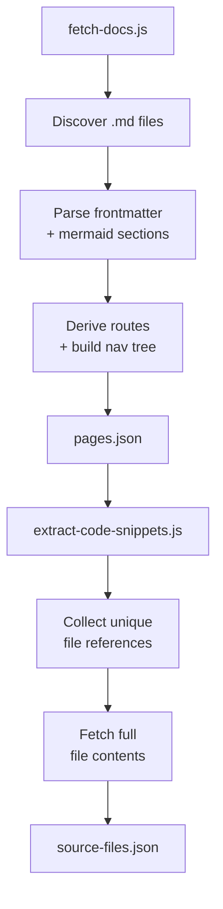
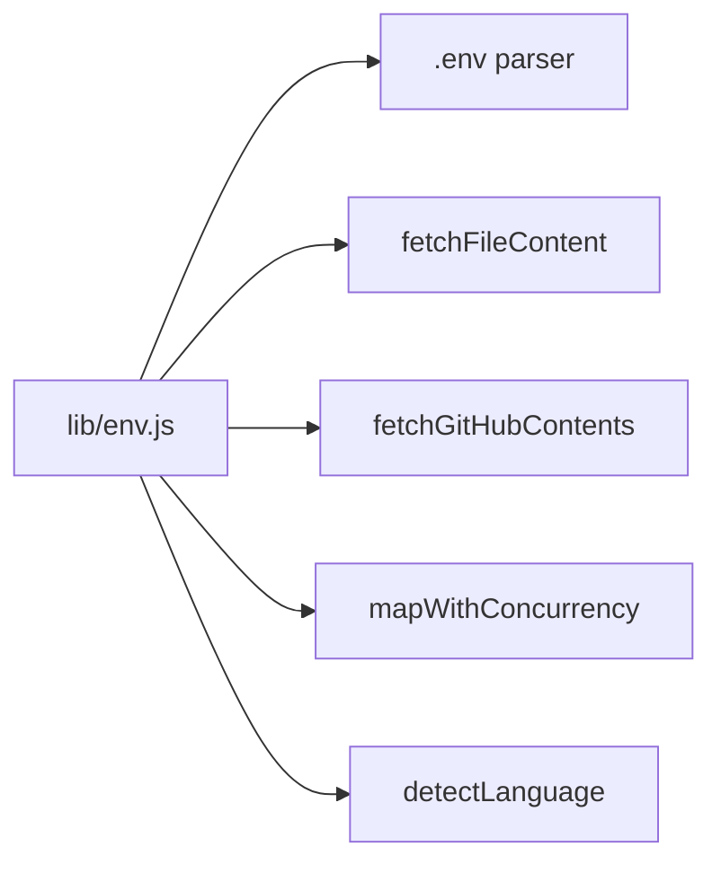

## Overview

The build pipeline runs two Node scripts sequentially before the Vite dev server starts. Step 1 discovers and parses markdown files into a page map. Step 2 collects every source file referenced by mermaid click directives and fetches their full content. Both scripts output JSON files into `app/src/data/` which the React frontend imports at build time.

## Step 1: fetch-docs.js

Discovers markdown files in the target repo's docs directory using one of two modes:

| Mode | Trigger | How it works |
|------|---------|-------------|
| **Local** | `LOCAL_REPO_ROOT` is set | Recursive `fs.readdirSync` on `{LOCAL_REPO_ROOT}/{DOCS_PATH}` |
| **Remote** | `GITHUB_TOKEN` is set | GitHub Contents API recursively, then raw content fetch |

Each markdown file is parsed by `parseMarkdownContent()` which extracts:
- YAML frontmatter via `gray-matter` (title, description, tags)
- Prose sections (raw markdown between mermaid fences)
- Mermaid code fences with `click` directives linking nodes to source files

Routes are derived from file paths by `fileToRoute()`. Index pages for directories without an `index.md` are synthesized automatically.

## Step 2: extract-code-snippets.js

Reads `pages.json`, walks every mermaid section's `nodeFiles`, and collects unique file paths. Each file is fetched in full (with concurrency of 10) and stored with its detected language and line count.

The full file content is stored intentionally — line-range extraction happens at runtime in the browser, which means changing a click directive's line range doesn't require re-running the build.

## Shared Utilities: lib/env.js

Both scripts share `build/lib/env.js` for environment loading, file fetching, and concurrency helpers. The `.env` file is parsed by a tiny inline loader (no dotenv dependency).

## Output Files

Both JSON files are gitignored and rebuilt on every `npm run dev` or `npm run build`. Use `npm run dev:cached` to skip rebuilding.

| File | Contents |
|------|----------|
| `app/src/data/pages.json` | `{ pages, navTree }` — page map keyed by route + navigation tree |
| `app/src/data/source-files.json` | Map of file path to `{ language, totalLines, content }` |
