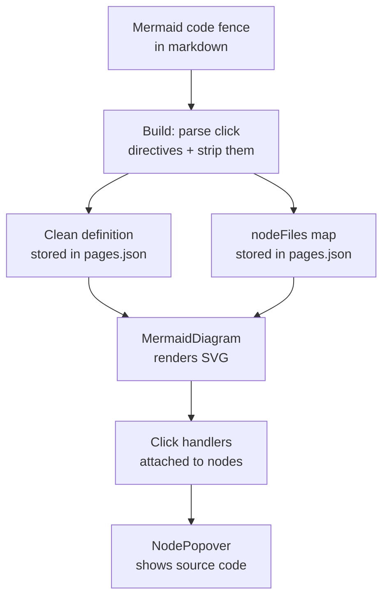
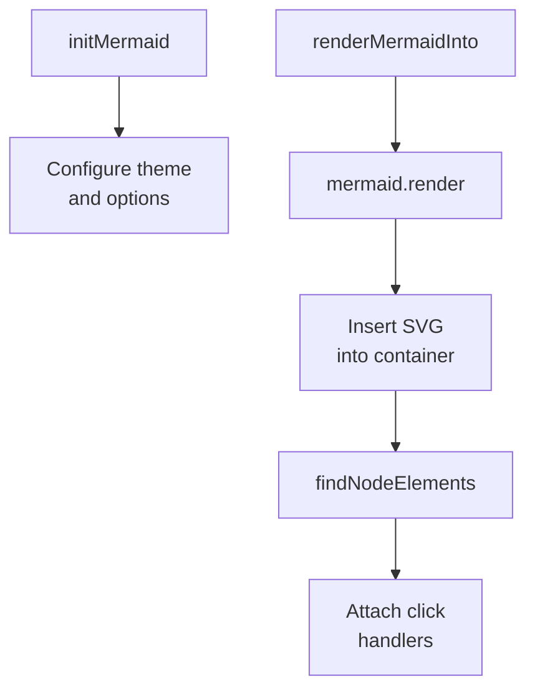

## Overview

Mermaid diagrams are the core interactive feature of Doc Viewer. Authors write standard mermaid syntax in markdown code fences, adding `click` directives that link diagram nodes to specific source files and line ranges. The build step parses these directives, and the frontend renders the SVG and attaches click handlers that open source code popovers.



## Click Directive Format

Inside a mermaid fence, each `click` directive binds a node ID to a source file:

```
click NodeID href "#" "path/to/file.rb:15-30"
click NodeID href "#" "path/to/file.rb"
```

- `href "#"` is mandatory (literal) — the app intercepts clicks via JS, not links
- Paths are relative to the repository root
- Line ranges use `startLine-endLine` format
- Omit the range to reference the full file

## Build-Time Parsing

`extractClickDirectives()` uses a regex to pull `nodeId` and `fileRef` from each directive. The file reference is split into path + optional line range. `stripClickDirectives()` removes the `click` lines from the definition so Mermaid doesn't try to interpret them as navigation.

For sequence diagrams, `extractParticipantMap()` captures `participant ALIAS as Display Name` mappings. These are needed at render time because sequence diagram nodes are matched by display text, not by ID.

## Render-Time: MermaidDiagram Component

The `MermaidDiagram` component handles the full lifecycle:

1. **Initialize Mermaid** once with a warm editorial theme matching the site design
2. **Render SVG** via `mermaid.render()` into a container div
3. **Find node elements** in the SVG using 5 matching strategies
4. **Attach click handlers** that toggle a popover with the source file reference



## Node Matching Strategies

Finding the right SVG element for a node ID is non-trivial because Mermaid generates different ID patterns for different diagram types. `findNodeElements()` tries 5 strategies in order:

| Strategy | Selector | Diagram type |
|----------|----------|-------------|
| 1. Flowchart pattern | `[id*="flowchart-{nodeId}-"]` | Flowcharts |
| 2. Direct ID | `#{nodeId}` | Generic |
| 3. Data-id attribute | `[data-id="{nodeId}"]` | Various |
| 4. Participant text match | Text content search | Sequence diagrams |
| 5. ID contains | `[id*="{nodeId}"]` | Fallback |

Strategy 4 is special: it walks all `<text>` elements in the SVG, matches against the `participantMap` display names, and returns the parent `<g>` group. This handles sequence diagram participants which appear at both the top and bottom of the diagram.

## Fullscreen Mode

Each diagram has an expand button (visible on hover) that opens a fullscreen overlay. The overlay re-renders the diagram independently with its own click handlers and popover state. Escape closes the popover first, then the overlay on a second press.
