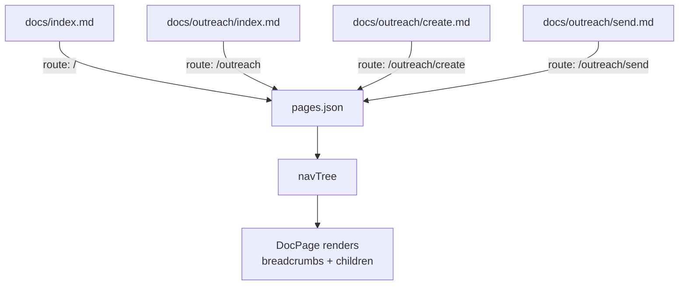
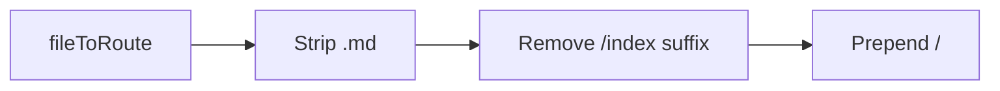
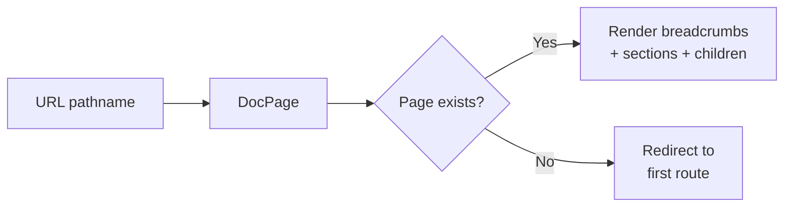

## Overview

Doc Viewer uses file-system routing. The directory structure of markdown files in the target repo directly determines the URL routes in the frontend. There is no route configuration file — routes are derived automatically during the build step.



## Route Derivation

The `fileToRoute()` function converts a relative file path to a URL route:

| File path | Route |
|-----------|-------|
| `index.md` | `/` |
| `outreach/index.md` | `/outreach` |
| `outreach/create.md` | `/outreach/create` |
| `outreach/workflows/foo.md` | `/outreach/workflows/foo` |

Rules:
- `.md` extension is stripped
- `index` files map to their parent directory path
- All routes start with `/`



## Parent-Child Relationships

Each page has a `parentRoute` derived from its URL path. For `/outreach/create`, the parent is `/outreach`. This creates a hierarchy used for:

- **Breadcrumb navigation** — `buildBreadcrumbs()` walks up the parent chain
- **Index page child cards** — `getChildren()` finds pages whose `parentRoute` matches the current route
- **Nav tree grouping** — `buildNavTree()` nests pages under their parents

## Synthesized Index Pages

If a directory contains child pages but no `index.md`, the build automatically creates a synthetic index page. The title is derived from the directory name (capitalized, underscores to spaces). This ensures every parent route resolves to a page.

## Page Object Shape

Each page in `pages.json` contains:

```json
{
  "route": "/outreach/create",
  "title": "Creating an Outreach",
  "description": "How the outreach creation flow works",
  "tags": ["outreach", "controllers"],
  "isIndex": false,
  "parentRoute": "/outreach",
  "sourcePath": "docs/outreach/create.md",
  "sections": [
    { "type": "prose", "content": "## Overview\n..." },
    { "type": "mermaid", "id": "flowchart", "definition": "...", "nodeFiles": {} }
  ]
}
```

## Frontend Routing

The React app uses a single catch-all `<Route path="*">` that renders `DocPage`. DocPage reads the current URL via `useLocation()`, looks up the matching page object, and renders it. If no page matches, it redirects to the first route in the nav tree.


