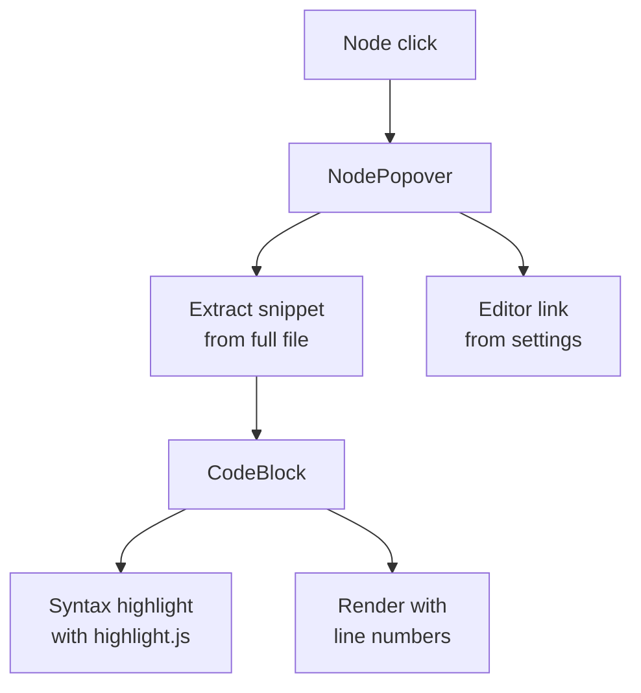
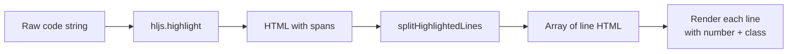

## Overview

When a user clicks a diagram node, a floating popover appears showing the relevant source code. The popover extracts the line range at render time from full file content stored in `source-files.json`, applies syntax highlighting with highlight.js, and provides a link to open the file in the user's preferred editor.

## NodePopover

`NodePopover` receives a `fileRef` (file path + optional line range), the full `sourceFiles` map, and an anchor element for positioning. It uses `@floating-ui/react-dom` to position itself below the clicked node with automatic flipping and shifting to stay within the viewport.

### Line-Range Extraction

The build stores entire files. NodePopover extracts the relevant snippet at render time via `useMemo`:

| Scenario | Behavior |
|----------|----------|
| Line range specified (e.g. `:29-49`) | Extract lines with 2 lines of context above/below |
| Full file, under 100 lines | Show entire file |
| Full file, over 100 lines | Truncate at 100 lines with a notice |

Context lines are rendered with reduced opacity so the focus range stands out visually.

### Dismissal

The popover closes on:
- Escape key
- Clicking outside the popover
- Clicking the same node again (toggle behavior, handled in MermaidDiagram)
- Clicking the close button

## CodeBlock

`CodeBlock` handles syntax highlighting and line-number rendering. It registers a subset of highlight.js languages (Ruby, JavaScript, HTML, ERB, CSS, YAML, JSON) to keep the bundle small.

### Per-Line Highlighting

highlight.js outputs HTML with `` tags that may span multiple lines. `splitHighlightedLines()` splits the HTML by newline and tracks open/close spans to keep each line's HTML valid. This enables per-line styling (focus vs. context).

## Editor Integration

The settings dropdown in the header lets users pick an editor and set their local repo path. NodePopover reads these from `localStorage` and builds a URL scheme link:

| Editor | URL scheme |
|--------|-----------|
| VS Code | `vscode://file/{path}:{line}` |
| Cursor | `cursor://file/{path}:{line}` |
| WebStorm | `webstorm://open?file={path}&line={line}` |
| RubyMine | `rubymine://open?file={path}&line={line}` |
| Sublime Text | `subl://open?url=file://{path}&line={line}` |
| Vim (MacVim) | `mvim://open?url=file://{path}&line={line}` |

The file path in the popover header is clickable when a repo path is configured. Without a repo path, it displays as plain text with a tooltip hint.
