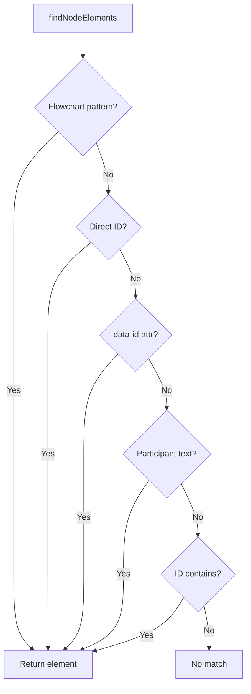

## Overview

The diagram interaction flow is the core UX of Doc Viewer. When a user clicks a node in a Mermaid diagram, the app finds the associated source file reference, extracts the relevant code snippet, and displays it in a floating popover with syntax highlighting and an editor link.

## Click-to-Source Flow

```mermaid
sequenceDiagram
  participant U as User
  participant MD as MermaidDiagram
  participant FN as findNodeElements
  participant NP as NodePopover
  participant CB as CodeBlock

  U->>MD: clicks diagram node
  MD->>MD: click handler fires
  MD->>MD: setPopover with nodeId + fileRef + anchorEl
  MD->>NP: render with fileRef + sourceFiles + anchorEl
  NP->>NP: useMemo: extract line range from full file
  NP->>NP: useFloating: position below anchor
  NP->>CB: pass code snippet + language + line info
  CB->>CB: hljs.highlight
  CB->>CB: splitHighlightedLines
  CB->>U: rendered popover with syntax-highlighted code

  click MD href "#" "app/src/components/MermaidDiagram.jsx:108-114"
  click FN href "#" "app/src/components/MermaidDiagram.jsx:43-85"
  click NP href "#" "app/src/components/NodePopover.jsx:23-157"
  click CB href "#" "app/src/components/CodeBlock.jsx:76-125"
```

## Step-by-Step Breakdown

### 1. Click Event

When `MermaidDiagram` renders the SVG, it iterates over `nodeFiles` and calls `findNodeElements()` to locate each node's SVG element. A click listener is attached that calls `setPopover()` with the node ID, file reference, and the clicked element (used as the positioning anchor).

The handler toggles: clicking the same node again closes the popover.

### 2. Node Element Discovery

`findNodeElements()` tries 5 strategies to find the SVG element for a given node ID. This is necessary because Mermaid generates different ID patterns depending on diagram type:



For sequence diagrams, strategy 4 is critical: it searches `<text>` elements for the participant's display name (from `participantMap`) and returns the parent `<g>` group. Since participants render at both top and bottom, multiple elements may be returned and all get click handlers.

### 3. Popover Positioning

`NodePopover` uses `@floating-ui/react-dom` with three middleware:

| Middleware | Purpose |
|-----------|---------|
| `offset(12)` | 12px gap between node and popover |
| `flip` | Flip to top if insufficient space below |
| `shift` | Shift horizontally to stay within viewport |

The popover auto-updates its position when the page scrolls or resizes.

### 4. Code Snippet Extraction

The `useMemo` in NodePopover extracts the relevant lines from the full file content:

- **With line range** (e.g. `:29-49`): extracts lines 27-51 (2 lines of context on each side)
- **Full file, <=100 lines**: shows everything
- **Full file, >100 lines**: truncates at 100 lines with a notice

Context lines render with `code-line--context` class (dimmed), focus lines with `code-line--focus` (highlighted background).

### 5. Syntax Highlighting

`CodeBlock` runs `hljs.highlight()` on the extracted code, then `splitHighlightedLines()` breaks the HTML output into per-line chunks while keeping `<span>` tags balanced across line breaks. Each line is rendered with its line number and focus/context styling.

### 6. Editor Link

If the user has configured a repo path in settings, the file path in the popover header becomes a clickable link. `editorUrl()` combines the repo path, relative file path, and line number into a URL scheme for the selected editor (e.g. `vscode://file/path/to/repo/app/controllers/foo.rb:29`).

### 7. Fullscreen Mode

The expand button on each diagram opens a `FullscreenOverlay` that re-renders the diagram at full viewport size. The overlay has its own independent popover state. Escape closes the popover first, then the overlay on a second press. Clicking the backdrop closes the overlay directly.
